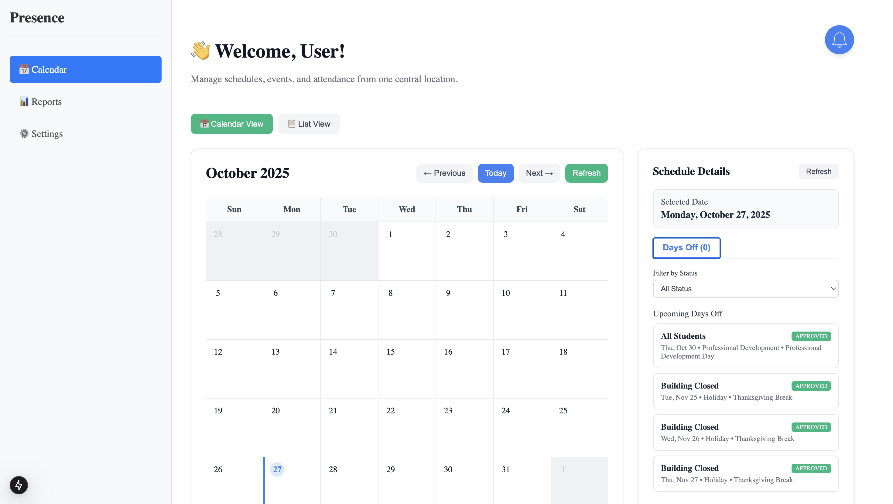
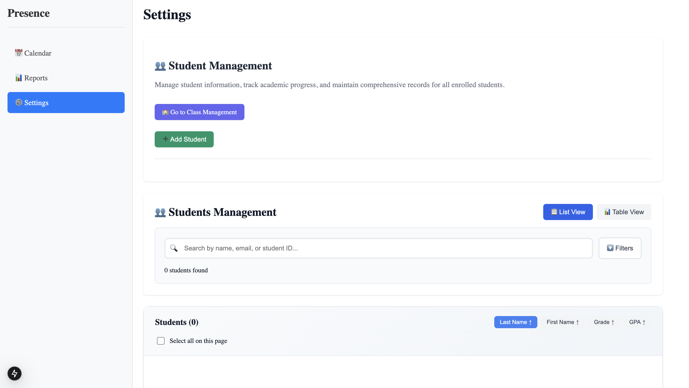

# Presence: Centralized Attendance Management System
**Team 6 - Code Society 25.2 Cohort**

[](https://cs-25-2-team6.vercel.app/)
[](LICENSE)

---

## Team Members

| **Martha Ofuani** | **Jared Edge** | **Linda Quinoa** | **Benjamin Scott** | **Thomas Boyle** |
|-------|-------|-------|-------|-------|
|  |  |  |  |  |
| **Scrum Master & Front-End Developer** | **Lead Full-Stack Developer** | **Backend Developer** | **Front-End Developer** | **Front-End Developer** |

Each team member contributed individual pull requests with working code and comprehensive test coverage, following agile development practices and maintaining high code quality standards.

---

## App Description

Presence is a centralized attendance system that can be used by teachers and staff, so the process of tracking attendance is standardized, reducing the likelihood of manual entry errors. It makes the process of generating reports and reviewing attendance data more efficient because it provides the functionality to sort and filter through electronic records quickly. The system streamlines attendance recording, generates automated reports, and provides real-time alerts to ensure student safety and administrative efficiency.

---

## Problem Statement

In many small or underfunded schools, the process of tracking attendance is done on paper and later manually entered into a spreadsheet, which increases the risk of inaccurate data. The manual process also makes it difficult to aggregate data and identify students who are frequently absent or late that may require direct intervention.

---

## Demo

**Live Demo:** [https://cs-25-2-team6.vercel.app/](https://cs-25-2-team6.vercel.app/)

---

## Feature Overview

- **Individual and Batch Attendance Record Submission** - Streamlined attendance tracking for single students or entire classes
- **Scheduling Planned Days Off** - Automated excused absences for holidays and scheduled non-school days
- **Attendance Report Creation** - Comprehensive reporting with filtering and sorting capabilities
- **Student & Class Profile Management** - Complete student and class organization system
- **Alert System & Data Validation** - Automated notifications and real-time validation

---

## Screenshot Gallery

| Dashboard | Reports |
|-----------|---------|
|  |  |
| **Student Management** | **Class Management** |
|  |  |

---

## Known Issues

- "Add Scheduled Days Off" button missing.
- "Filter" buttons on the Alerts Dashboard does not have full functionality.
- Interventions tab doesn't update when a new alert is selected.
- Formatting issues with "Add Student" form.

---

## Roadmap Features

- **Enhanced reporting and analytics to measure student outcomes** - Advanced analytics dashboard with improved filtering, KPI tracking, and trend analysis
- **Enhance reporting and analytics to measure teacher outcomes** - Teacher performance insights and classroom analytics with correlation analysis
- **Integration with grading system for correlation analysis** - Connect attendance data with academic performance for comprehensive insights
- **Text/Email notifications** - Real-time communication system for automated parent alerts and teacher notifications
- **Student & Parent Portal** - Self-service platform with excuse note submission, historical attendance view, and direct teacher feedback
- **Mobile-responsive design** - Tablet and phone access for on-the-go attendance management
- **Role-based access control** - Different permission levels for teachers, administrators, and support staff
- **Cloud database integration** - Scalable production deployment with enhanced data security

## Tech Stack

| Category | Technologies |
|----------|-------------|
| **Frontend** | Next.js 14, React, TypeScript, Tailwind CSS |
| **Backend** | Node.js, TypeScript, Next.js API Routes |
| **Database** | File-based JSON storage (development) |
| **Testing** | Jest, 80%+ coverage, Integration tests |
| **Deployment** | Vercel (planned) |
| **Development** | Git/GitHub, VS Code, ESLint |

---

## Installation Instructions

### Prerequisites
- Node.js (v18 or higher)
- npm or yarn package manager
- Git for version control

### Setup Instructions

1. **Clone the Repository**
```bash
git clone https://github.com/code-differently/cs-25-2-team6.git
cd cs-25-2-team6
```

2. **Install Dependencies**
```bash
npm install
```

3. **Run Development Server**
```bash
npm run dev
```
Open [http://localhost:3000](http://localhost:3000) to view the application.

5. **Run Tests**
```bash
# Unit tests with coverage
npm test

# Integration tests
npm run test:integration

# View coverage report
npm run test:coverage
```

## Credits

- **Code Differently** - Educational guidance and capstone framework
- **GitHub Copilot** - AI-powered code completion and development assistance
- **ChatGPT/OpenAI** - AI assistance for documentation, problem-solving, and code review
- **Claude** - AI assistance for documentation and wireframes
- **Next.js Team** - React framework for production applications
- **Vercel** - Deployment platform for seamless hosting
- **Jest Community** - Comprehensive testing framework
- **Tailwind CSS** - Utility-first CSS framework for rapid UI development

---